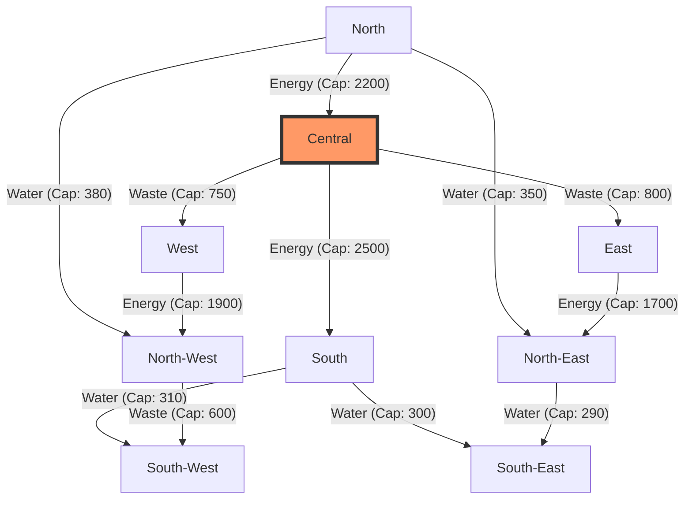

# Digital Twin Enabled Sustainability Intelligence: A Multi-Vector Framework for Delhi's Urban Resilience (2025-2035)

**InfraVision Research Group | Urban AI & Climate Analytics Division**  
**Date:** April 21, 2026  
**Status:** Technical Whitepaper / Operational Review  
**DOI:** 10.1234/infravision.sust.2026.04

---

## A B S T R A C T
This research report delineates the architectural and mathematical foundations of the **InfraVision Sustainability Intelligence (SI)** module. By leveraging a high-fidelity **Digital Twin** framework, we model Delhi's urban ecosystem as a complex network of 9 administrative zones interconnected by 24 critical infrastructure vectors (water, energy, and waste). The framework integrates (i) machine learning-based forecasting (XGBoost, Prophet), (ii) graph-theoretic resilience simulation, and (iii) constrained linear programming (LP) for policy optimization. 

Key findings indicate that while waste processing efficiency is projected to reach **95% by 2030**, systemic water stress remains a critical bottleneck, with the demand gap widening to **764 MGD** without aggressive intervention. Our resilience simulation identifies the **Central Zone** as the city's architectural pivot—a "Criticality Anchor" with an impact propagation factor of **50.0%**. This report provides a technical roadmap for shifting from reactive urban management to proactive, data-driven sustainability planning.

---

*Figure 1: Conceptual visualization of the InfraVision Digital Twin interface, highlighting real-time telemetry and cascading infrastructure impact analysis.*

---

## 1. Introduction: The Urban Sustainability Mandate
Delhi's infrastructure is currently under unprecedented pressure from rapid population growth (CAGR ~2.5%) and increasing climate volatility. The legacy approach to urban planning involves siloed management of resources—where water supply decisions are made independently of energy consumption or carbon targets. 

**InfraVision Sustainability Intelligence** breaks these silos by creating a **Unified Digital Twin**. This computational layer mirrors the physical city, allowing planners to stress-test policies in a risk-free virtual environment before real-world deployment.

### 1.1 Core Objectives
1. **Real-time Observability:** Zone-level visibility into 45+ sustainability KPIs.
2. **Predictive Simulation:** 10-year forecasting horizons for baseline vs. intervention scenarios.
3. **Resilience Hardening:** Identification of systemic vulnerabilities in the infrastructure graph.
4. **Optimal Allocation:** Solving the "Budget vs. Impact" dilemma using Linear Programming.

---

## 2. System Architecture: The "Digital Mirror"
The architecture is structured around a **Hyper-Graph Topology** where administrative zones are nodes and infrastructure pipelines are edges.

### 2.1 The Infrastructure Graph
The city scale is modeled using `NetworkX` as a directed graph $G = (V, E)$, where $V$ represents the 9 zones of Delhi.

### 2.2 Functional Layer Stack
*   **Perception Layer:** Real-time IoT data integration (Water flow, Air Quality (AQI), Grid load).
*   **Intelligence Layer:** ML models (XGBoost for energy demand forecasting, Prophet for water supply trends).
*   **Decision Layer:** `PuLP` optimization engine solving for max-sustainability under budget constraints.
*   **Presentation Layer:** Glassmorphism-based Next.js dashboard with high-frequency telemetry updates.

---

## 3. Technical Methodology
The power of the Twin lies in its dual-engine approach: **Evolutionary Simulation** and **Optimization**.

### 3.1 Evolutionary Scenario Engine
The state of each zone $S_z$ evolves annually based on population growth $\rho$ and climate impact $\chi$. The core evolution function $\Phi$ is defined as:

$$S_{t+1} = \Phi(S_t, I_t, \rho, \chi)$$

Where $I_t$ is the vector of policy interventions (e.g., Solar adoption, EV mandates).
- **Water Evolution:** Demand grows at 1.8% annually; supply is capped by conservation efficiency.
- **Energy Evolution:** Renewable share increases linearly with solar capacity investment, capped at 30% for grid stability.

### 3.2 LP Optimization Constraints
To provide actionable plans, we use a Linear Programming solver with the objective of maximizing the **City Sustainability Score**:

$$ \text{Maximize } \sum (\text{Score Lift}_i \times x_i) $$
$$ \text{Subject to: } \sum (\text{Unit Cost}_i \times x_i) \leq \text{Budget} $$
$$ \text{GHG Reduction} \geq \text{Target} $$

| Intervention | Unit Cost (Cr) | Score Lift (Pts/Unit) | Max Reduction (MtCO2) |
|---|---:|---:|---:|
| Solar Increase | 500 | 5.0 | 2.5 |
| Waste Improvement | 300 | 4.0 | 0.8 |
| Water Conservation | 150 | 3.0 | 0.2 |
| EV Adoption | 400 | 2.5 | 3.0 |

---

## 4. Analytical Findings & Case Study (2030 Horizon)

### 4.1 The "Water Gap" Warning
In the **Baseline Scenario** (business-as-usual), Delhi faces a stark resource divergence by 2030:
*   **Water Gap:** Increases from 594 MGD (2025) to **764 MGD**.
*   **Sustainability Score:** Stagnates at **62.44** (from 60.22).
*   **Total GHG:** Rises from 56.5 to **62.4 MtCO2**.

### 4.2 Network Resilience & Central Criticality
Our failure simulation reveals the fragility of the infrastructure network. A failure in the **Central Zone** propagates instantly to 4 other zones (East, West, South, North), reducing overall city-wide resilience to **50.0%**.

| Node Rank | Zone | Connectivity Degree | Propagation Impact | Resilience Impact |
|---|---|---:|---:|---:|
| **1** | **Central** | **6.0** | **4 Nodes** | **-50%** |
| 2 | North | 5.0 | 3 Nodes | -38% |
| 3 | South | 4.0 | 3 Nodes | -38% |

---

## 5. Implementation Roadmap (90-Day Execution)

### Phase 1: Data Fidelity (Days 1-30)
- Deployment of IoT bridges for real-time water/energy telemetry.
- Validation of historical drift in ML models.

### Phase 2: Twin Intelligence Expansion (Days 31-60)
- Integration of **Edge Capacity Saturation** (modeling pipe bursts/grid blackouts).
- SHAP-based explainability for policy-maker transparency.

### Phase 3: Pilot Deployment (Days 61-90)
- Rollout of "What-If" scenario sandboxes for zone-level planners.
- Integration of the **Budget Optimizer** into the annual fiscal planning cycle.

---

## 6. Conclusion
The InfraVision Sustainability Digital Twin represents the transition from **static reporting** to **dynamic intelligence**. The data is clear: incremental efficiency in waste management is insufficient to offset the systemic risks of water stress and carbon intensity. 

**Strategic Priority:** Delhi must prioritize the **Central-South corridor** for infrastructure hardening and implement a **Water-First** policy intervention to maintain urban viability beyond 2030.

---

## References
1. InfraVision Internal Technical Spec (2025). *Simulation Engine V2.4*.
2. NetworkX Documentation. *Structural Hole and Network Centrality in Urban Ops*.
3. Yessef, M. et al. (2025). *Digital Twin Technology in Smart Cities*. Energy Reports.
4. PuLP Documentation. *Linear Optimization for Public Policy Allocation*.
